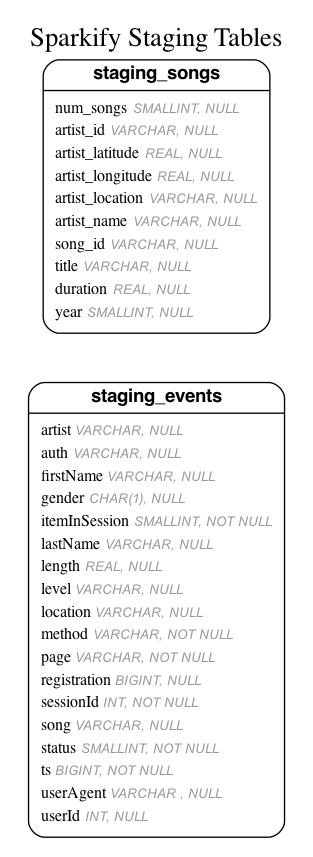

# Million Song Dataset JSON -> AWS RedShift

Load data from the [Million Song Dataset](https://labrosa.ee.columbia.edu/millionsong/) into a final dimensional model in RedShift. 

## Introduction

A fictional music streaming startup, Sparkify, has grown their user base and song database and want to move their processes and data onto the cloud. Their data resides in S3, in a directory of JSON logs on user activity on the app, as well as a directory with JSON metadata on the songs in their app. The files in this repository will assist in loading the data into a final dimensional model in AWS RedShift.

## Design

### Staging

#### Data Model & ETL

Data is extracted from S3 buckets and loaded into the following staging tables.




#### Design Decisions

* Utilized psql `COPY` comand to quickly load data into staging tables. Example from staging_events:

```sql
COPY staging_events 
FROM 's3://udacity-dend/log_data'
IAM_ROLE 'DWH_IAM_ROLE_NAME'
REGION 'us-west-2' compupdate off 
JSON 's3://udacity-dend/log_json_path.json';
```

### Dimensional Model & ETL

Data is extracted from staging tables and inserted into the dimensional model shown below.


#### Design Decisions

* `songplay` and `songs` is distributed on the RedShift slices with distkey `song_id`
  * Expecting user query behavior to be based around determining which songs are most played
  * This will significantly reduce shuffling during joings between `songplay` and `songs` tables
* `level` in `users` is the most recent `level` using the timestamp field `ts` in `staging_events`
  * Could have created the `users` table as a slowly changing dimension (i.e. created `level_current` and `level_at_time_of_play`) but specification does not indicate that
  * Obtained most recent level with use of psql windowing function:
```sql 
SELECT DISTINCT 
        userid,
        firstName,
        lastName,
        gender,
        level
FROM (
SELECT userid,
       firstName,
       lastName,
       gender,
       level,
       ROW_NUMBER() OVER (PARTITION BY userid ORDER BY ts DESC) as rn
FROM staging_events
WHERE userid IS NOT NULL -- do not pull in to users table values with NULL id's
) 
WHERE rn = 1
```
* Distributed dimension tables `users`, `time`, `artists` among all slices on RedShift cluster (using RedShift `diststyle all`) since small size to reduce shuffling when joining to these tables from `songplay`


## Files

* environment.yml
  * Anaconda yaml file to reproduce execution environment. Load this environment when running python scripts.
* dimensional_model.er & stage_schema.er
  * Entity-relationship files used to generate ER diagram images. See https://github.com/kaishuu0123/vscode-erd
* create_redshift_cluster_database.py
  * Create AWS RedShift cluster & create sparkify db
* sql_queries.py
  * DROP, CREATE, INSERT, COPY statements for all sparkify db objects
* create_tables.py
  * CREATE and DROP all required tables in sql_queries.py
* etl.py
  * ETL cordinator to run INSERT & COPY SQL scripts in sql_queries.py
* cleanup_cluster.py
  * Remove RedShift AWS cluster as well as created IAM role
* dwh.cfg
  * Config file for all necessary variables for AWS RedShift, sparkify db, IAM role, and S3 buckets

## Installation

Clone this repository:

`git clone https://github.com/rigganni/AWS-RedShift-Music-Analysis.git`

Set up the following variables in dwh.cfg:

| variable | description |
| ------------ | --------- |
| DWH_CLUSTER_TYPE | multi-node |
| DWH_NUM_NODES | number of nodes for cluster |
| DWH_NODE_TYPE | i.e. dc2.large |
| DWH_HOST | will be written to in create_redshift_cluster_database.py |
| DWH_IAM_ROLE_NAME | i.e. dwhRoleS3 |
| DWH_CLUSTER_IDENTIFIER | dwhCluster |
| DWH_DB | sparkify |
| DWH_DB_USER | sparkify user |
| DWH_DB_PASSWORD | sparkify passwd |
| DWH_PORT | specify port |
| DWH_REGION | us-west-2 since required S3 files are stored there |
| DWH_CLUSTER_SUBNET_NAME | use if RedShift cluster is required in specific VPC |
| DWH_ROLE_ARN | written to in create_redshift_cluster_database.py |
| DWH_CLUSTER_SUBNET_GROUP_NAME | use if RedShift cluster is required in specific VPC |
| KEY | AWS key |
| SECRET | AWS secret |
| ARN | written to in create_redshift_cluster_database.py |
| LOG_DATA | s3://udacity-dend/log_data |
| LOG_JSONPATH | s3://udacity-dend/log_json_path.json |
| SONG_DATA | s3://udacity-dend/song_data |

## Usage

Create Anaconda environment using given environment.yml file:

`conda env create -f environment.yml`

It will create an environment called `million-song-redshift`. Activate that environment once created:

`conda activate million-song-redshift`

Ensure variables are set up in dwh.cfg as described in installation above.

Create RedShift IAM role, cluster, and database:

`python create_redshift_cluster_database.py`

Create tables in sparkify db:

`python create_tables.py`

Load data into staging and onto the dimensional model:

`python etl.py`

Once finished, delete cluster and IAM role:

`python cleanup_cluster.py`